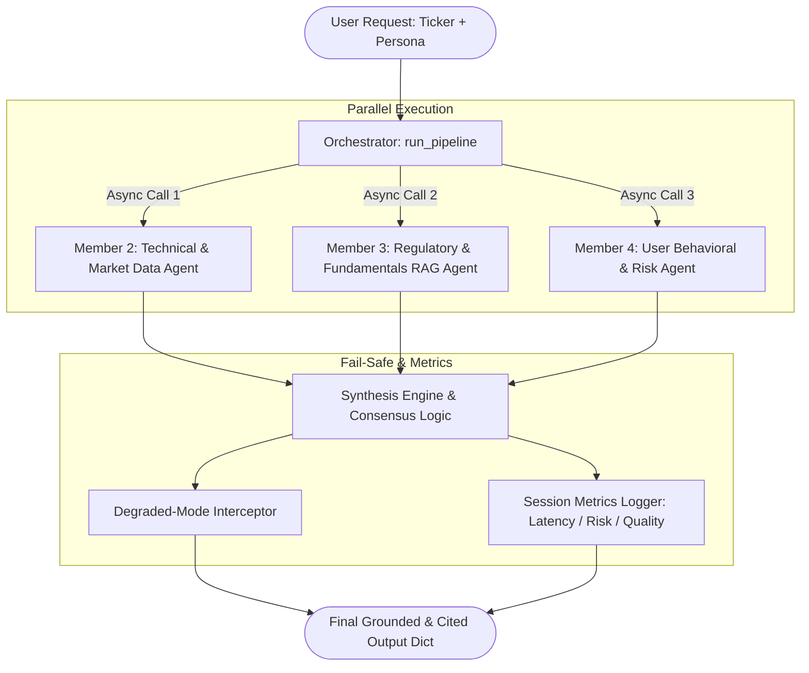

# Sprint1
# Multi-Agent Autonomous Financial Intelligence System (PS-01)
## Sourav: Pipeline Orchestrator & Degraded-Mode Lead Prototype

This directory contains the complete prototype implementation for **Member 1 (Pipeline Orchestrator & Degraded-Mode Lead)** for the IEEE RAS Hackverse Hackathon (VIT Chennai).

---

## 🚀 Key Deliverable
The primary deliverable function is:
```python
from orchestrator import run_pipeline

# Usage:
result = run_pipeline(ticker="RELIANCE", persona_id="p_conservative", degraded_mode=False)
```

### Output Schema:
`run_pipeline` returns a comprehensive Python dictionary containing:
1. **`pipeline_status`**: `"HEALTHY"` or `"DEGRADED_OPERATIONAL"`
2. **`alert_badge`**: Dynamic alert banner (e.g. `None`, `"CONTRADICTION_ALERT: TECHNICAL_VS_REGULATORY"`, or `"DEGRADED_STATE_ALERT: RAG_FEED_UNAVAILABLE"`)
3. **`synthesized_intelligence`**:
   - `consensus_type`: Multi-perspective consensus classification (`SIGNAL_CONVERGENCE`, `SIGNAL_DIVERGENCE_WARNING`, `VALUE_DIVERGENCE`, etc.)
   - `recommendation`: Actionable guidance (`BUY`, `ACCUMULATE_STAGGERED`, `CAUTIOUS_HOLD`, `AVOID_OR_TRIM`, etc.)
   - `confidence_score`: Blended conviction score between 0.0 and 1.0
   - `executive_summary`: Concise summary accessible in under 60 seconds
   - `personalized_rationale`: Breakdown with persona allocation limit, headroom, and SEBI retail F&O safeguards
   - `reasoning_chain`: Step-by-step transparent justification traceable to source evidence
4. **`source_attributions`**: List of all cited disclosures (e.g. `NSE_LIVE_TICK_FEED`, `SEBI_DISCLOSURE_REG30`, `EARNINGS_TRANSCRIPT_Q3FY26`)
5. **`performance_metrics`**:
   - `total_pipeline_latency_ms` & individual agent latencies (Sub-60s compliance)
   - `portfolio_risk_concentration_score` & flag (`HEALTHY` vs `OVER_LIMIT`)
   - `data_completeness_score` (1.0 in normal mode, 0.50 in degraded mode) & `consensus_confidence_score`

---

## 📂 Architecture Overview



---

When parv, utsav and madhvav complete their respective modules, they plug directly into `orchestrator.py` via custom providers:

```python
from orchestrator import FinancialIntelligenceOrchestrator

# Instantiate with real member functions:
orchestrator = FinancialIntelligenceOrchestrator(
    technical_provider=my_member2_module.analyze_stock,
    rag_provider=my_member3_module.query_sebi_rag,
    profile_provider=my_member4_module.fetch_user_profile
)

result = orchestrator.execute_pipeline("RELIANCE", "p_aggressive", degraded_mode=False)
```

### Member Contracts:
- **Parv (Technicals):** Must accept `(ticker: str, degraded: bool = False)` and return dict with `{"signal": "BULLISH"|"BEARISH"|"NEUTRAL", "confidence": float, "indicators": dict, "citations": list}`.
- **Utsav (RAG/SEBI):** Must accept `(ticker: str, degraded: bool = False)` and return dict with `{"sentiment": "POSITIVE"|"CAUTIOUS"|"NEGATIVE", "document_chunks": list, "citations": list}`.
- **Madhav (User Risk):** Must accept `(persona_id: str)` and return dict with `{"risk_tolerance": "CONSERVATIVE"|"MODERATE"|"AGGRESSIVE", "max_single_stock_allocation_pct": float, "current_portfolio": dict}`.
- **Ishank (Frontend & Explainability UI):** Live Signals, Reasoning Traces, Portfolio

---

## 🧪 Running the Test Suite

Run the automated test suite to demonstrate all 5 judging criteria:

```bash
python test_orchestrator.py
```

### Verified Scenarios:
1. **Scenario 1:** Normal Pipeline Execution (End-to-End with full reasoning chain & citations).
2. **Scenario 2:** Behavioral Persona Divergence (Identical stock data produces distinct recommendations for Conservative vs Aggressive users).
3. **Scenario 3:** Signal Contradiction (Bullish price breakout conflicting with RBI/SEBI regulatory headwinds triggers warning alert badge).
4. **Scenario 4:** Degraded State Simulation (`degraded_mode=True` gracefully falls back with `DEGRADED_STATE_ALERT` without crashing or losing attribution).
5. **Scenario 5:** Performance Telemetry Logging (Verifies all 3+ mandatory metrics).
